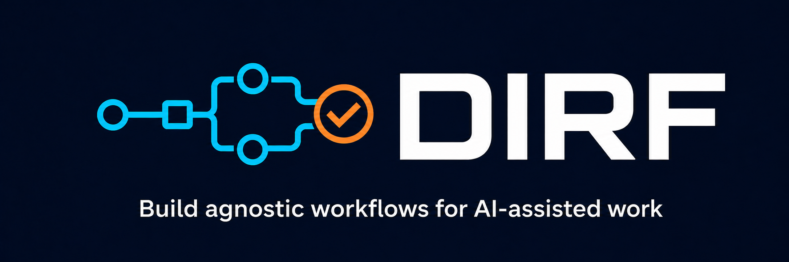

# DIRF — Do It Right First



DIRF turns a task into a small, executable instruction set for AI coding agents.
It inspects the target repository, maps the capabilities actually installed on
the host, assigns bounded roles, and leaves behind a human-readable workflow.

**AMF** = Agent Marketing Factory · **DIRF** = Do It Right First.

> Requires Node.js ≥ 18.17. Zero dependencies. No `npm install`.

## What DIRF helps with

- **Wrong skills:** resolves capabilities from the current repo and host instead
  of assuming every machine has the same tools.
- **Prompt drift:** keeps the objective, role boundaries, policy, and done-when
  checks inside the generated artifact.
- **Bloated context:** loads one small router first, then only the detail needed
  for the active stage.
- **Weak handoffs:** produces durable markdown for agents and a matching HTML
  view for people.
- **Skipped verification:** makes evidence and completion checks part of the
  workflow, not an afterthought.

## How DIRF is different

| Typical agent setup | DIRF |
| --- | --- |
| One large prompt | A small router with lazy-loaded detail |
| Hardcoded skill names | Capability requests resolved against installed skills |
| Missing tools fail silently | Gaps are explicit and approval-gated |
| Instructions tied to one agent host | Portable, host-neutral workflow snapshots |
| “Done” means the agent stopped | Done-when checks and evidence travel with the task |

DIRF is the preflight layer. It does not replace Codex, Claude, or another
executor; it gives that executor a repo-aware route before work begins.

## Quick start

```bash
git clone https://github.com/gpb360/amf-dirf.git
cd amf-dirf

# One-time setup for the repository you want DIRF to work on
node src/cli.js setup ../my-project --reserve-percent 5

# Task -> routed workflow -> lean markdown + human HTML
node src/cli.js build first-run "fix the checkout timeout" --path ../my-project
```

Open the generated `.dirf/attempts/<timestamp>-first-run/README.md`. It contains
the ordered workflow and the handoff your agent host should execute.

Useful next commands:

```bash
node src/cli.js flow "review this pull request" --path ../my-project
node src/cli.js skills scan
node src/cli.js list --path ../my-project
node src/cli.js validate
```

## The pipeline

```
task description or folder README
  │
  ▼  router (keyword -> playbook match)
workflow folder
  │   agents[]         each: {name, file, tags, skills[]}
  │   baseline_skills[]   cross-cutting skills for the whole workflow
  │
  ▼  renderer (reads each agent .md + resolves skills against the live index + policy)
  │
  ├─► lean MARKDOWN instruction set  (what the AI consumes — token-cheap)
  │     one router README + one lazy-loaded detail file per agent + policy
  │
  └─► HTML render of the SAME structure  (human-browsable, expand-on-demand)
        summary index + collapsible per-agent sections
```

**Markdown is source; HTML is the render** of the same lean structure.

## Output structure (lean, progressive disclosure)

```
.dirf/attempts/<timestamp>-<name>/
├── attempt.json                        # portable attempt identity
├── workflow.json                       # resolved workflow snapshot
├── README.md                           # authoritative router and frontmatter
├── policy.md                           # the workflow policy (one level deep)
├── agents/
│   ├── frontend-developer.md           # lazy-loaded detail per agent
│   └── ...
└── instructions.html                   # self-contained human render (gitignored)
```

The AI loads `README.md` first, follows its ordered folder references, then
loads only the detail file required by the active stage.
Unread files cost zero tokens.

DIRF reserves 5% of model context for a structured `HANDOFF.md` by default.
Hosts that expose remaining context trigger the handoff at that threshold;
otherwise the workflow checkpoints after each completed phase. A different
model can continue with `dirf resume <name-or-id> --path <project>`.

Each per-agent detail file is self-contained: role, **USE THESE SKILLS**
(resolved live from the host index, with installed/recommended status),
**YOUR JOB** (from the agent markdown), **NOT YOUR JOB** (boundary), and a
done-when checklist.

## CLI reference

```
dirf build  <name> "<task>" [--path DIR] [--open]   full pipeline: route -> JSON -> md + html
dirf create <name> "<task>" [--path DIR]             route -> workflow JSON only
dirf setup [path] [--tracker local] [--context single|multi] [--reserve-percent 5]
dirf render <name-or-id> [--path DIR] [--open]       render the latest matching attempt
dirf list [--path DIR]                               list target attempts
dirf resume <name-or-id> [--path DIR]                load workflow + HANDOFF.md
dirf migrate [<name-or-id>] [--path DIR]             refresh schema 2–5 attempt snapshots
dirf validate                                        validate registries + workflows
dirf validate <folder>                               validate one folder DAG
dirf graph <folder>                                  show deterministic execution order
dirf run <folder>                                    emit the execution handoff
dirf render <folder>                                 generate its human HTML view
dirf skills scan                                     scan host, show installed skills + resolved refs
```

Run `node src/cli.js` with no arguments for help.

## Folder contract

DIRF uses four separate filesystem units with one small README-frontmatter
interface: `skills/`, `tools/`, `playbooks/`, and `workflows/`. Skills contain
bounded task directions; tools contain invocation and safety details; playbooks
compose reusable work; workflows bind a concrete task. References form an
ordered DAG, execute once, reject cycles, and lazy-load optional details.

This provides filesystem-first definitions, bounded context, modular execution,
approval before side effects, and traceable evidence. Markdown is source, HTML
is a generated human view, and the zero-dependency JavaScript CLI is the resolver.

The previous committed `workflows/user/*.json` files were generated snapshots,
not authored workflows, and were removed. `dirf migrate` refreshes snapshots
already stored under a configured target's `.dirf/attempts/`; it does not import
the deleted legacy files.

Generated attempts are host-neutral. Claude, Codex, another agent, or a person
can execute the same README. Repository and installation paths are discovered
for the current run only; snapshots retain capability names and provider hints.
If a task needs isolation, keep worktrees beside the target repository unless
the user configures another workspace root, and select scratch space inside that
workspace instead of using an implicit operating-system temp directory.

## How skill mapping works (the heart of "right")

The kit ships a small editable vocabulary in `registry/skills.json` that enriches
discovered metadata. Playbooks request capabilities; they do not force skill names.
DIRF deterministically selects the best installed match for each stage and keeps
missing capabilities out of the executable flow.

```json
{"name": "impeccable", "category": "quality",
 "applies_to": ["frontend-developer", "ui-designer"],
"summary": "product-quality review using YAGNI, DRY, and KISS"}
```

At build time, `discover()` scans the host environment and resolves each
reference:

- **installed** — found in a scanned root (path included)
- **capability gap** — no installed match; DIRF asks before suggesting or creating anything

**Scan roots** (all optional): `~/.agents/skills/`, `~/.codex/skills/`,
`~/.claude/skills/`, `~/.zcode/.../skills/`, plus project-local equivalents.
Discovery reads `SKILL.md` first, falling back to `skill.json` then `README.md`
— so skills like `ui-ux-pro-max` (no `SKILL.md`) and `superpowers` (under a
plugin cache) are still found.

**Scoping with `--path`:** pass `--path <project>` to scan *that* project's
local skill folders in addition to the global roots, so the instruction set
reflects the target project's skills (e.g. a repo's own `.agents/skills/`).

## Making it yours

- **Add an agent**: drop a markdown file in `agents/` (frontmatter: `name`,
  `description`, `tools`), add an entry to `registry/agents.json` with its
  `skills` refs.
- **Add a skill to the vocabulary**: add an entry to `registry/skills.json`.
  The kit resolves it against whatever's installed on each host.
- **Add a playbook**: create `playbooks/<name>/README.md`; the JSON registry is
  compatibility output, not the editable source.
- **Trust skill sources**: create `~/.dirf/trusted-sources.json` or
  `<project>/.dirf/trusted-sources.json` with a `sources` array. Each source may
  declare `name`, `url`, and `capabilities`. DIRF only suggests configured sources
  and always requires approval before installation or local derivation.
- Then run `node src/cli.js validate`.

## Project layout

```
src/             CLI, folder resolver, router, discovery, renderer, validation
playbooks/       authoritative reusable playbook folders
skills/          bounded task-oriented skill folders
tools/           isolated tool invocation folders
registry/        agents, skill metadata, and legacy compatibility JSON
agents/          agent markdown definitions (21 curated)
policies/        workflow-policy.md (embedded in every instruction set)
tests/           <domain>.test.js files using node:test
scripts/         smoke.js integration check
workflows/       authored reusable workflow folders
.dirf/attempts/  target-owned generated runs (gitignored in each target repo)
```

## Conventions

- **Zero dependencies.** Pure Node.js built-ins (no `node_modules`).
- **One entry point:** `src/cli.js`.
- **Names:** kebab-case folders, domain-named source files, and `<domain>.test.js` tests.
- **Generated output:** `.dirf/attempts/`, `graphify-out/`, and HTML renders stay untracked.
- **Markdown playbooks are source; generated attempts and HTML are disposable** (gitignored).
- **Validate before you commit:** `node src/cli.js validate`.

## Running the tests

```bash
npm test                                   # all unit tests (node:test)
npm run test:router                        # router matching
npm run test:skills                        # discovery + resolver
npm run test:renderer                      # markdown + HTML rendering
npm run smoke                              # full pipeline integration
```

No test runner to install — Node's built-in `node:test` is used. CI runs the
suite on every push (`.github/workflows/ci.yml`).

## License

MIT — see [LICENSE](LICENSE).
